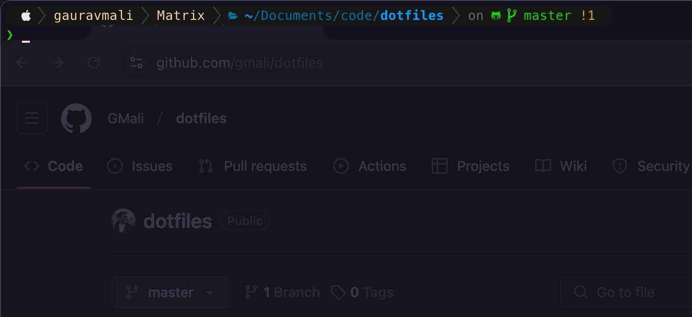

# README

**Table of Contents**
- [README](#readme)
  - [Preview](#preview)
  - [How to setup a new machine](#how-to-setup-a-new-machine)
    - [Download and setup iTerm2](#download-and-setup-iterm2)
    - [Zsh](#zsh)
    - [Homebrew](#homebrew)
    - [Stow](#stow)
  - [How to backup changes to this repo](#how-to-backup-changes-to-this-repo)

## Preview



## How to setup a new machine

Make sure that you clone this repo in the root `~/` directory.

### Download and setup iTerm2

1. You can find install instructions on [iterm website](https://iterm2.com/).
2. Install the fonts found in the `iterm/fonts/` folder.
3. Set up dynamic profiling and copy the profiles from the `iterm/` folder.
4. If that doesn't automatically set up the colors, import them manually from the `iterm/` folder.


### Zsh

1. You can find install instructions on [zsh website](https://ohmyz.sh/)
2. Look at the plugins listed in `.zshrc` and install them manually.
3. Install the [powerlevel10K theme](https://github.com/romkatv/powerlevel10k)


### Homebrew

```
xargs brew install < brew/leaves.txt
```

### Stow

```
stow --adopt .
```

Create a `~/.localgitconfig` file with the new email address associated with this new machine


## How to backup changes to this repo

```
./brew/backup.sh
````
Then commit and push changes